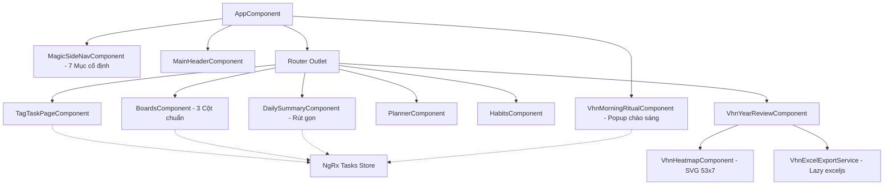
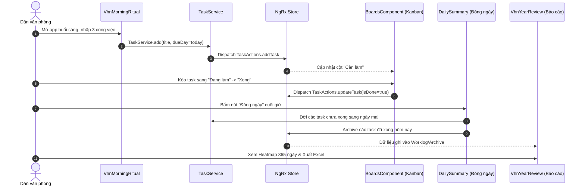

# Rebuild Analysis: Việc Hôm Nay (Dựa trên Super Productivity)

Tài liệu phân tích kiến trúc phục vụ Rebuild / Deep Fork mã nguồn Super Productivity thành ứng dụng **"Việc Hôm Nay"** dành cho người đi làm & dân văn phòng Việt Nam, thực thi theo phương pháp **Native**.

---

## 1. Application Overview
- **Ứng dụng gốc:** Super Productivity (v19.1.0, tác giả Johannes Millan, giấy phép MIT).
- **Mục tiêu Rebuild:** Tái cấu trúc sâu (Deep Fork - Hướng B) để tạo ra sản phẩm hoàn chỉnh mang tên **"Việc Hôm Nay"** (`vn.viechomnay.app`).
- **Khách hàng mục tiêu:** Dân văn phòng, người đi làm tại Việt Nam có nhu cầu quản lý công việc cá nhân hằng ngày theo phong cách tối giản, trực quan, không rườm rà.
- **Triết lý sản phẩm:** Local-first, dữ liệu thuộc sở hữu người dùng, không bắt buộc đăng ký tài khoản, tập trung vào vòng lặp hàng ngày: *Chào sáng (Lập kế hoạch) ➔ Làm việc (Kanban / Focus / Pomodoro) ➔ Đóng ngày (1 chạm) ➔ Thống kê (Review năm).*
- **Nền tảng đích:** Web App (PWA, Docker) ➔ Desktop Windows (.exe NSIS/Portable) ➔ Microsoft Store (MSIX).

---

## 2. Technology Stack
- **Frontend Framework:** Angular 21.2.22 (Standalone Components, Signals, RxJS).
- **UI & Component Library:** Angular Material, CDK (Drag & Drop), Lucide/Material Icons, Custom SCSS CSS Variables Design Tokens.
- **State Management:** NgRx 21.1.1 (Store, Effects, Actions, Entity, Selectors) kết hợp Angular Signals.
- **Bản địa hóa (i18n):** `@ngx-translate/core` v17.0.0, ngôn ngữ gốc tiếng Việt (`vi.json`).
- **Desktop Shell:** Electron 43.5.0 (Node integration tắt, Context Isolation bật, IPC handlers bảo mật).
- **Mobile Container (giữ tương thích):** Capacitor 8.4.1.
- **Lưu trữ dữ liệu (Client-side):** IndexedDB qua Dexie/idb wrapper + LocalStorage.
- **Export Engine:** `exceljs` (Lazy-loaded).
- **Build & Bundler:** Angular CLI (`@angular-devkit/build-angular:application`), `electron-builder`.

---

## 3. Repository Architecture
```
super-productivity/
├── electron/                  # Tiến trình Electron Main Process & IPC Handlers
│   ├── ipc-handlers/          # IPC điều khiển window, file, dialog, system
│   ├── main-window.ts         # Quản lý BrowserWindow
│   ├── start-app.ts           # Khởi động app & system tray
│   └── protocol-handler.ts    # Đăng ký custom protocol scheme
├── packages/                  # Monorepo packages dùng chung (giữ nguyên không đổi)
│   ├── sync-core/             # Logic đồng bộ dữ liệu cốt lõi
│   ├── shared-schema/         # Schema dữ liệu dùng chung
│   └── plugin-api/            # Interfaces
├── src/
│   ├── app/
│   │   ├── core/              # Services nền tảng (theme, locale, banner, db)
│   │   ├── core-ui/           # Shell UI: magic-side-nav, header, layout
│   │   ├── root-store/        # NgRx Root Store (Task, Project, Tag...)
│   │   ├── pages/             # Các trang lớn (daily-summary, config-page...)
│   │   └── features/          # 44 modules nghiệp vụ
│   │       ├── tasks/         # Quản lý task, subtask, time estimate
│   │       ├── boards/        # Kanban board kéo thả
│   │       ├── planner/       # Lập kế hoạch theo ngày / tuần
│   │       ├── pomodoro/      # Bộ đếm Pomodoro
│   │       ├── focus-mode/    # Màn hình tập trung sâu
│   │       ├── habits/        # Theo dõi thói quen
│   │       ├── worklog/       # Lịch sử ghi nhận giờ làm việc
│   │       ├── vhn-morning-ritual/  # [NEW] Chào sáng & gom việc nhanh
│   │       └── vhn-year-review/     # [NEW] Báo cáo năm & Heatmap 365 ngày
│   ├── assets/i18n/           # Từ điển đa ngôn ngữ (vi.json là chuẩn chính)
│   └── styles/                # 3-Layer CSS tokens & SCSS themes
```

---

## 4. Entry Points
1. **Web / PWA:** `src/main.ts` ➔ bootstrap `AppComponent` (`src/app/app.component.ts`).
2. **Desktop (Electron):** `electron/main.ts` ➔ `electron/start-app.ts` ➔ `createMainWin()` tải dev URL `http://localhost:4200` hoặc production file `.tmp/angular-dist/browser/index.html`.
3. **Routing Dispatcher:** `src/app/app.routes.ts` ➔ chuyển hướng mặc định tới Today tag (`/tag/TODAY/tasks`) hoặc Kanban (`/boards`).

---

## 5. Routes / Screens

| Route | Component | Chức năng nghiệp vụ | Trạng thái trong VHN |
|---|---|---|---|
| `/tag/TODAY/tasks` | `TagTaskPageComponent` | Danh sách công việc hôm nay | Giữ lại (Màn hình chính) |
| `/boards` | `BoardsComponent` | Bảng Kanban (Cần làm / Đang làm / Xong) | Tinh chỉnh mặc định |
| `/planner` | `PlannerComponent` | Lên kế hoạch theo tuần & kéo việc giữa ngày | Giữ lại |
| `/habits` | `HabitsComponent` | Theo dõi thói quen lặp lại hàng ngày | Giữ lại (theo yêu cầu) |
| `/year-review` | `VhnYearReviewComponent` | Báo cáo năm, Heatmap 365 ô, xuất Excel | **Module mới** |
| `/active/daily-summary`| `DailySummaryComponent` | Đóng ngày, tổng kết & dời task tồn | Rút gọn tối giản |
| `/config` | `ConfigPageComponent` | Cài đặt ngôn ngữ, theme, sync | Lược bỏ mục thừa |
| `/donate` | `DonatePageComponent` | Quyên góp bản gốc | **Xoá bỏ hoàn toàn** |

---

## 6. Component Architecture & Relationships


---

## 7. State Management
- **Store Architecture:** NgRx Single Source of Truth, duy trì tính nguyên bản của Action/Reducer/Selector đối với dữ liệu Task, Project, Tag, WorkContext.
- **State Partitioning:**
  - `tasks`: Quản lý danh sách task, quan hệ cha-con (subtasks), thời gian dự kiến và thực tế.
  - `boards`: Lưu cấu hình cột của Kanban board (`DEFAULT_BOARD_CFG` được ghi đè bằng `VHN_DEFAULT_BOARD_CFG`).
  - `workContext`: Context hiện tại (Today Tag, Inbox, Project cụ thể).
  - `globalConfig`: Cấu hình toàn cục (Theme, Localization `vi-VN`, firstDayOfWeek = 1).
- **Nguyên tắc Rebuild:** Không sửa cấu trúc Entity State để dữ liệu sao lưu của người dùng luôn tương thích hoàn toàn.

---

## 8. Data Flow


---

## 9. API / Backend
- Ứng dụng hoạt động theo kiến trúc **Offline-First / Local-First**.
- Không phụ thuộc vào bất kỳ API Server độc quyền nào.
- Toàn bộ backend issue trackers cồng kềnh (Jira, GitLab, OpenProject, Redmine, Nextcloud, Plainspace, Caldav) bị gỡ bỏ, giải phóng tài nguyên CPU và bộ nhớ.

---

## 10. Database / Persistence
- **Client Storage:** IndexedDB (database tên `SUP`) kết hợp LocalStorage lưu cấu hình UI nhỏ.
- **Đồng bộ tùy chọn (User-owned):** Local File Sync, WebDAV, Dropbox, OneDrive.

---

## 11. Authentication / Authorization
- Không yêu cầu tài khoản hay đăng nhập. Mở app là dùng được ngay.

---

## 12. External Dependencies
- **Giữ lại:** Angular Material, NgRx, Capacitor, `@ngx-translate/core`.
- **Thêm mới (Lazy):** `exceljs` phục vụ tính năng xuất bảng kê công việc ra file Excel `.xlsx`.
- **Loại bỏ:** Các SDK của Jira, GitLab, GitHub, SuperSync client.

---

## 13. Important Business Logic
1. **Lập kế hoạch đầu ngày (Morning Ritual):**
   - Chỉ kích hoạt 1 lần duy nhất trong ngày dựa trên `lastRitualDay` so sánh theo múi giờ `Asia/Ho_Chi_Minh` (`YYYY-MM-DD`).
   - Tự động tách từng dòng nhập liệu thành các task riêng biệt.
2. **Cơ chế kéo thả Kanban 3 cột:**
   - Cột 1 (*Cần làm*): Task trong ngày chưa làm.
   - Cột 2 (*Đang làm*): Task được gán cờ/tag `IN_PROGRESS`.
   - Cột 3 (*Xong*): Task có cờ `isDone = true`.
3. **Đóng ngày & Chuyển giao công việc tồn:**
   - Tính toán ngày mai theo lịch thực tế (`Asia/Ho_Chi_Minh`), không phụ thuộc vào giờ hệ thống sau nửa đêm (0h - 4h sáng).
   - Tự động chuyển `dueDay` của task tồn sang ngày hôm sau chỉ với 1 click.
4. **Tính toán Heatmap & Chuỗi ngày (Streak):**
   - Hỗ trợ chính xác năm nhuận (366 ngày) và năm thường (365 ngày).
   - Chia 53 tuần cột SVG chuẩn chỉnh.

---

## 14. UI / Interaction Behavior
- **Tone & Mood:** Tinh tế, nhẹ nhàng, truyền cảm hứng tích cực.
- **Màu sắc chủ đạo:** Xanh ngọc Emerald (`#10B981`) tượng trưng cho sự tươi mới, hoàn thành, cam Amber (`#F59E0B`) nhấn mạnh việc cần chú ý.
- **Tương tác 1-chạm:** Hạn chế tối đa các popup khảo sát, đánh giá, quyên góp gây phân tâm.

---

## 15. Critical User Flows
1. **Flow Khởi đầu:** Mở app ➔ Chào buổi sáng ➔ Nhập task ➔ Tự động vào bảng Kanban.
2. **Flow Thực thi:** Xem Kanban ➔ Bật Pomodoro / Focus Mode khi cần tập trung ➔ Kéo việc vào Xong.
3. **Flow Kết thúc:** Bấm Đóng ngày ➔ Xem thống kê nhanh ➔ Dời việc tồn ➔ Nhận lời chúc động viên.
4. **Flow Đánh giá:** Mở Báo cáo ➔ Xem Heatmap 365 ngày ➔ Bấm "Xuất Excel" tải file `.xlsx`.

---

## 16. Must Preserve
- Hệ thống dữ liệu Task gốc (title, notes, subtasks, timeSpent, timeEstimate, tagIds, projectId).
- Bộ đếm Pomodoro và chế độ Focus Mode.
- Bộ theo dõi thói quen (Habits).
- Lịch tuần (Planner) và tính năng lặp lại công việc (Recurring tasks).
- Giấy phép MIT của Johannes Millan trong file `LICENSE`.

---

## 17. Can Change
- Tên ứng dụng, logo, favicon, icon hệ điều hành, appId.
- Giao diện thanh điều hướng Sidebar (cố định 7 mục).
- Giao diện trang Đóng ngày (Daily Summary) đơn giản hóa triệt để.
- Xóa bỏ toàn bộ các module tích hợp issue tracker và donate.
- Trang báo cáo mới thay thế hoàn toàn các màn hình thống kê cũ.

---

## 18. Risks & Mitigation
- **Rủi ro vỡ build khi gỡ issue providers:** Xử lý bằng cách gỡ từng module độc lập, kiểm tra và dọn dẹp triệt để các import và DI provider liên quan.
- **Rủi ro lệch múi giờ khi dời task:** Luôn chuẩn hóa ngày về `sv-SE` kết hợp timezone `Asia/Ho_Chi_Minh`.
- **Rủi ro phình dung lượng bundle do Excel:** Cài đặt `exceljs` và sử dụng Dynamic `import('exceljs')` để lazy-load khi người dùng nhấn nút xuất.

---

## 19. Rebuild Strategy
Triển khai cuốn chiếu theo mô hình **Native** (thực hiện tuần tự trong phiên làm việc, kiểm tra tính toàn vẹn và build sau mỗi chặng):
- **Chặng 1 (Brand & Config):** Rebrand định danh, locale tiếng Việt mặc định, CSS Design Tokens xanh ngọc, icon mới.
- **Chặng 2 (Clean Up):** Gỡ bỏ 7 issue providers, donate, please-rate, plugins, idle tracker; đảm bảo Angular build sạch.
- **Chặng 3 (Navigation & Core Views):** Chuẩn hóa Sidebar 7 mục, thiết lập Kanban 3 cột "Hôm nay", tinh giản màn hình Đóng ngày.
- **Chặng 4 (Specialized Features):** Xây dựng module `vhn-morning-ritual` và `vhn-year-review` kèm SVG Heatmap và Excel Export.
- **Chặng 5 (Packaging & Verification):** Kiểm tra Web App production, build Docker và chuẩn bị đóng gói Windows NSIS.

---

## 20. Verification Strategy
1. **Kiểm tra biên dịch:** `npx ng build --configuration=productionWeb` sau mỗi bước chỉnh sửa module.
2. **Kiểm tra Unit Test:** Chạy `npx ng test --watch=false` cho các module mới tạo.
3. **Kiểm tra Rebrand:** Quét toàn bộ repository để đảm bảo không còn chuỗi "Super Productivity" trên giao diện người dùng.
4. **Kiểm tra Runtime:** Khởi chạy server và xác minh trực quan trên trình duyệt (localhost:4200 hoặc Docker 8080).

---

## 21. Unknowns
- Hiện tại chưa có chứng chỉ ký số Windows Code Signing Certificate (chấp nhận cảnh báo SmartScreen ở bản cài nội bộ).
- Tài khoản Microsoft Partner Center để nộp Store sẽ được cấu hình ở Mốc 3.
